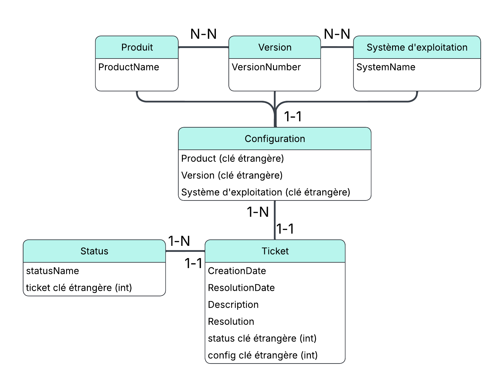

# Projet 6: Modélisez et créez une base de données pour une application .NET

Ce projet est une base de données ainsi qu'une API ASP.NET Core réalisée dans le cadre du projet 6 de la formation Openclassrooms "Développeur .NET". 

## Objectif

Créer une base de données de gestion de tickets et créer une API pour pouvoir l'interroger selon différents critères. 

## Fonctionnalités principales

- Consultation des tickets par critères: statut, produit, version, période, mots clés. 
- Combinaison libre de critères
- Retour de données sous forme de DTO pour faciliter l'affichage. 

## Prérequis

- .NET 8 SDK  
- SQL Server LocalDB
- Visual Studio 2022  
- SSMS pour restaurer ou consulter la base

## Lancer l’application en local

Une sauvegarde complète de la base (dump SSMS) est fournie dans le dossier Database. 

Restaurer la base de données depuis le dump et lancer le projet dans Visual Studio 2022. 

